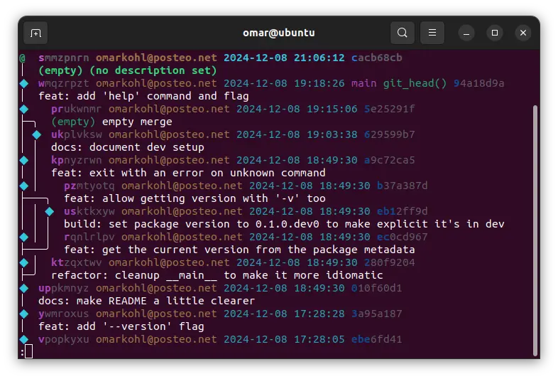

# Setup

## Installation

Start by installing `jj`, following the [installation
instructions](https://martinvonz.github.io/jj/latest/install-and-setup/).

Verify the installation was successful:

```bash title="Run"
jj version
```

```bash title="Expected output (similar)"
jj 0.24.0-32d2a85539254e9d96f9819072fa5c6ac70dd1e4
```


## Config

### Basics

Set some _global_ (for your user) configuration. Adapt as needed.

```bash title="Set your preferred text editor"
jj config set --user ui.editor vim
```

```bash title="Set email and name"
jj config set --user user.email ME@EXAMPLE.COM
jj config set --user user.name "MY NAME"
```

Make `jj` default to `jj log`, which is very convenient:

```bash
jj config set --user ui.default-command log
```

:::tip Repository-specific configuration

If you are inside a repository, you can set configuration that only applies to
that repository. Use `--repo` instead of `--user`.

:::


### (Optional) Make "log" more verbose

```bash title="If you are curious, see the default value"
jj config get revsets.log
```

```bash title="Change the value"
jj config set --user revsets.log "present(@) | ancestors(immutable_heads().., 7) | present(trunk())"
```


### (Optional) Manually edit the config file

```bash title="See location of config file"
jj config path --user
```

```bash title="Open the config file in an editor"
jj config edit --user
```


## Clone Repository

```bash title="Clone the repository"
jj git clone --colocate https://github.com/omarkohl/jj-tutorial
cd jj-tutorial
```

```bash title="See the log (history)"
jj
```




## (Optional) Try it in another Git repository

If you have any local Git repository I encourage you to try using `jj` in it too:

```bash
cd path/to/my/repo
jj git init --colocate
```

Now you can use `jj` with all the things you learn in this tutorial.

If you ever want to get rid of `jj` in this repository:

```bash
cd path/to/my/repo
rm -rf .jj/
```

That's it, as if `jj` had never been there! Any commits you created, rebased
etc. via `jj` will of course be there since `jj` synchronizes the `jj` data
with Git. It will just look as if everything had been done with Git.


## (Optional) Shell completion

If you use bash, you can add the following to your `~/.bashrc`:

```bash
source <(jj util completion bash)
```

See [more
examples](https://martinvonz.github.io/jj/latest/install-and-setup/#command-line-completion)
for other shells.


## (Optional) Live 'jj log'

A convenient way of permanently seeing the current state of your log is to run
this command in a separate terminal window and have it open next to your work.

```bash
cd path/to/repo
watch --color jj --ignore-working-copy log --color=always
```

See an explanation and alternatives
[here](https://martinvonz.github.io/jj/latest/FAQ/#can-i-monitor-how-jj-log-evolves).
